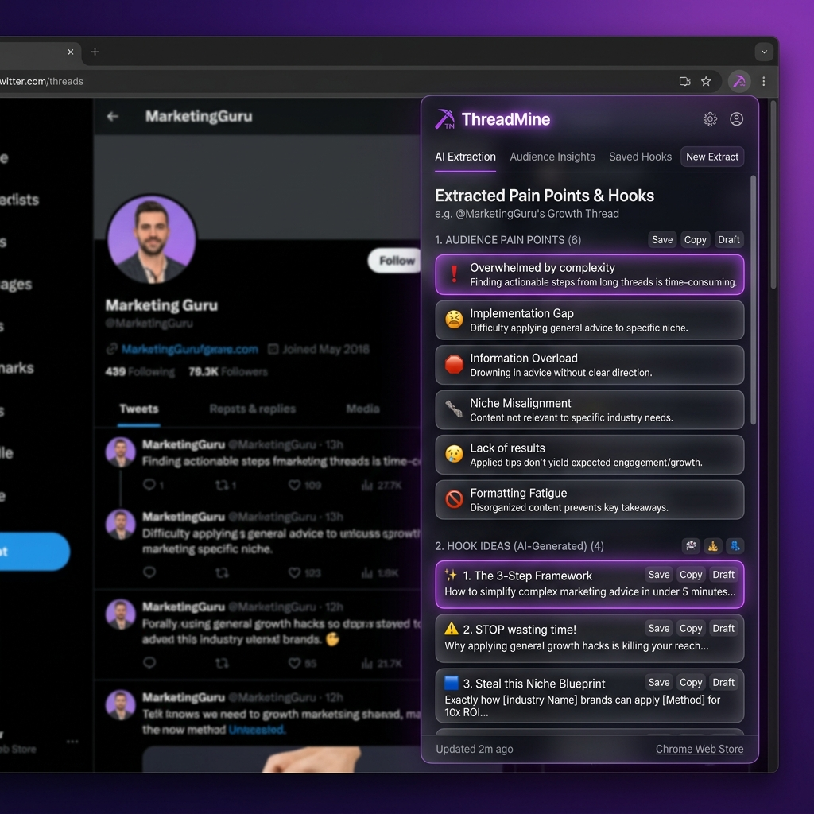
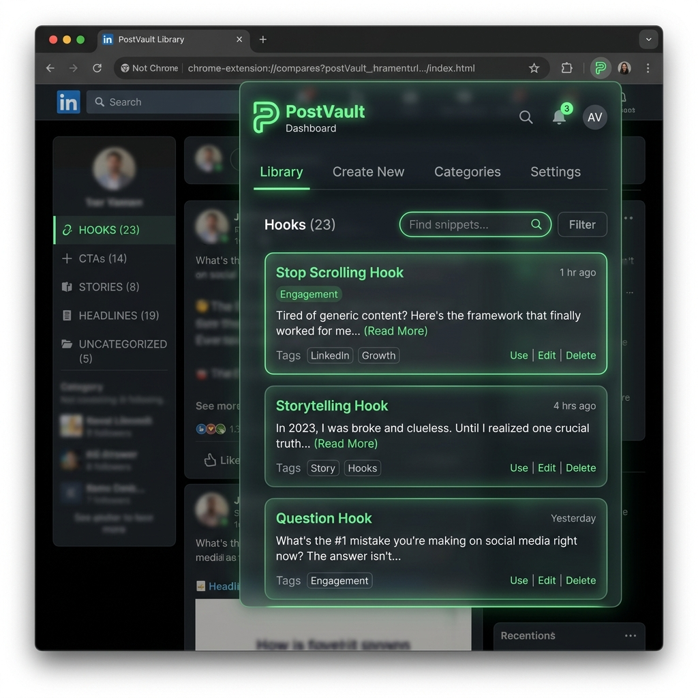
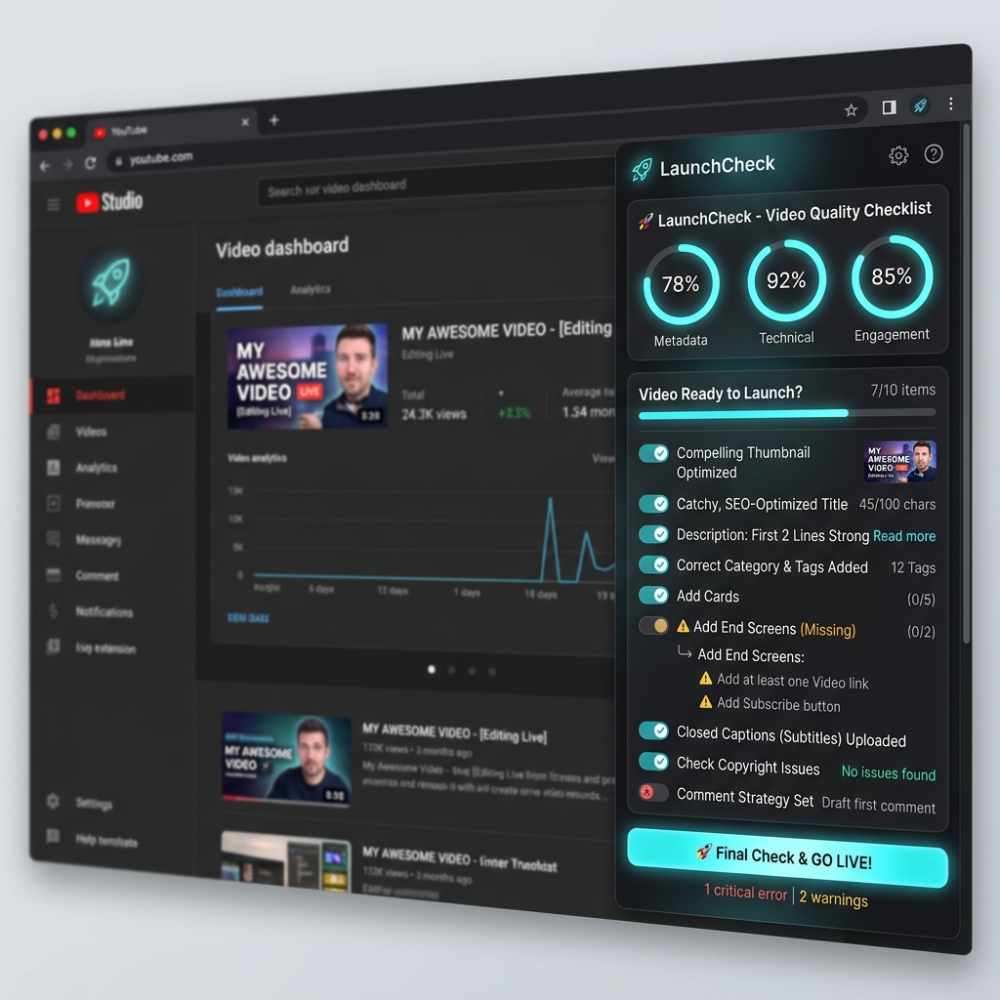
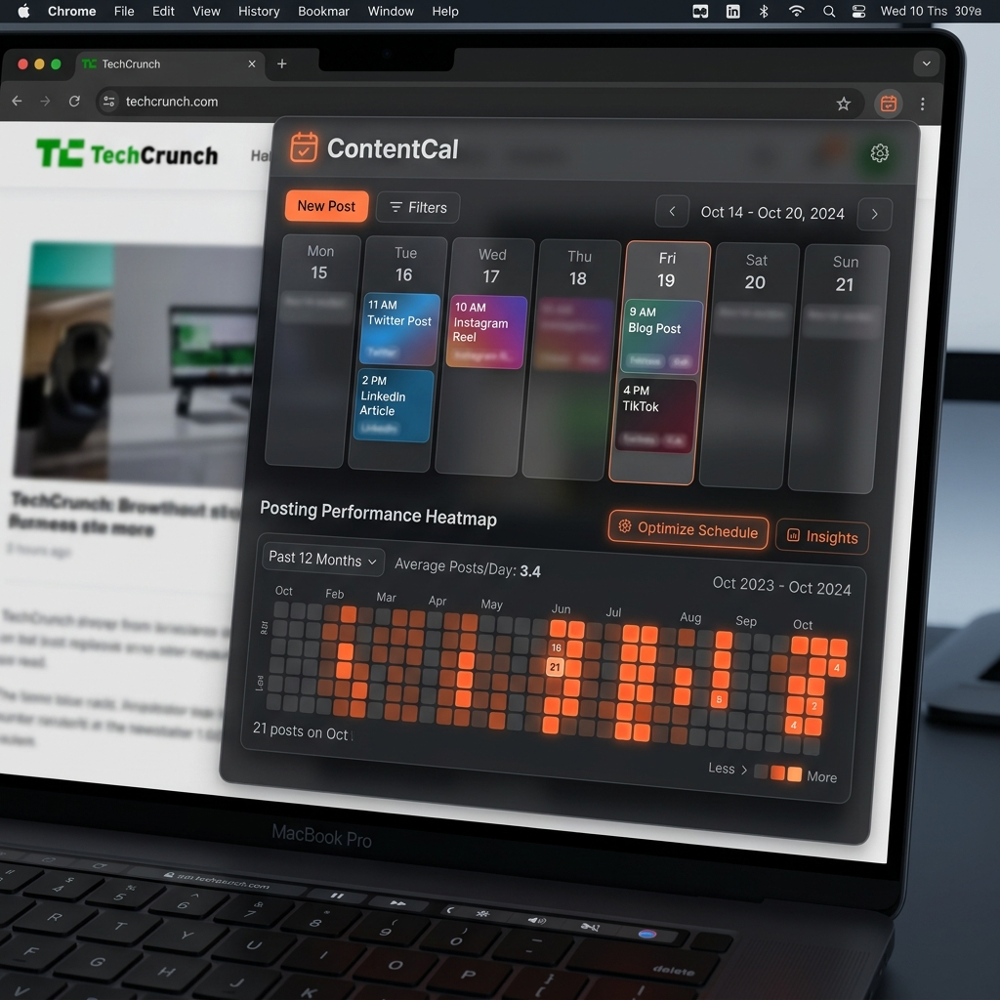

# Creator Chrome Extensions Suite

Welcome to the **Creator Chrome Extensions Suite** — an innovative, privacy-first ecosystem of browser tools built for the next generation of digital creators and developers. 

## 🛡️ Core Philosophy
This suite operates on strict, modern architectural principles:
- **Zero Cloud Reliance**: All analytical and user data is stored entirely on your local machine using `chrome.storage.local` and IndexedDB. 
- **Local AI Powered**: Deep integration with [Ollama](https://ollama.ai/) allows content generation, summarization, and data-mining using specialized Local LLMs running directly on your hardware. Data never leaves your endpoint.
- **Premium Unified UI**: Every extension is beautifully consistent, featuring a custom-built V2 aesthetic focusing on dark variants, sleek typography, dynamic accents (neon cyan, deep purple, atomic orange), and performance-optimized `backdrop-filter` glassmorphism.
- **Native Split Screen**: Every extension abandons full-page iframes in favor of seamless integration with **Chrome’s Native Side Panel API**. 

---

## 📦 The Suite

### 1. 🪨 ThreadMine (Audience Research Extractor)

*Stop doomscrolling and start mining signals.*
ThreadMine turns chaotic comment sections into organized content databases.
- **Context Menu Mining**: Right-click any Reddit thread, X (Twitter) post, or YouTube comment section to extract audience pain points, objections, and desires.
- **Ollama AI Insights**: Summarizes thread sentiment instantly, generating lists of "Hook Ideas" and "Frequently Asked Questions." 
- **Centralized Idea CRM**: Manages your research directly in a beautifully curated list view that acts as the starting point for your content creation.

### 2. 📌 PostVault (Creator Snippet Manager)

*Your library of reusable hooks, Call-to-Actions, and links.*
PostVault brings consistency and zero-friction typing to the publishing workflow.
- **Instant Snippet Injection**: Inject predefined hooks, CTAs, emojis, and links straight into the DOM of X, LinkedIn, Instagram, and YouTube.
- **Platform Variants**: Keep an idea unified while varying the text slightly for X vs. LinkedIn. The extension detects your active tab and pastes the correct variant.
- **Campaign Folders**: Organize product launches into distinct folders.
- **Toast Notifications**: Built-in, non-intrusive in-tab UI toasts confirm successful context-menu clipping and injects.

### 3. 🚀 LaunchCheck (Pre-Publish Quality Validator)

*A final stop-gap before hitting publish.*
LaunchCheck evaluates YouTube video packaging to reduce risk and maximize CTR.
- **Intelligent Title Analysis**: Leverages local AI to critique your title, propose 5 high-CTR alternative rewrites, and score "Hook Clarity."
- **Promise Match Engine**: Checks the synergy between your thumbnail text and the description body to ensure a united narrative.
- **Studio Injection**: Automatically scrapes the YouTube Studio data directly out of the active tab. 
- **Pre-flight Checklist**: A dynamic, interactive layout verifying mobile truncation rules, curiosity gaps, and alignment checkboxes.

### 4. 📅 ContentCal (Content Calendar & Scheduler)

*Track streaks, visualize heatmaps, and never miss an upload.*
A fully local performance dashboard bridging the gap between creation and analysis.
- **Visual Posting Schedule**: A weekly calendar view with platform-colored status chips to see your digital footprint at a glance.
- **Chrome Alarms**: Employs background service workers and the Alarms API to flash an alert when it's time to publish your next piece of content. 
- **Performance Heatmaps**: GitHub-level dark-mode heatmaps visualize your publishing velocity over a rolling 28-day window.
- **Stats Dashboard**: Track cross-platform consistency, published ratios, and your leading distribution channels completely offline.

---

## ⚙️ Shared Resources
All extensions share core code components housed in the `/shared` directory:
- `ai-client.js`: Multi-provider LLM connector with built-in CORS bypass capabilities via `DeclarativeNetRequest`.
- `ollama-client.js`: Direct Ollama local API integrations.
- `ui-components.css`: The "V2" glassmorphism stylesheet.
- `split-screen.js`: Advanced Chrome Side Panel docking and UI shifting.
- `chart-utils.js`: Vanilla canvas charting libraries for offline analytics.
- `storage-utils.js`: Powerful wrapper for `chrome.storage.local`.

## 🚀 Installation & Testing 
1. Ensure you have **Google Chrome** or a Chromium-based browser.
2. Go to `chrome://extensions/`
3. Toggle on **Developer Mode** in the top right edge.
4. Click **Load Unpacked** and select the specific extension folder (e.g., `threadmine`, `postvault`).
5. (Optional but recommended) Run `ollama serve` on port `11434` with an active model instance to power the AI capabilities.
